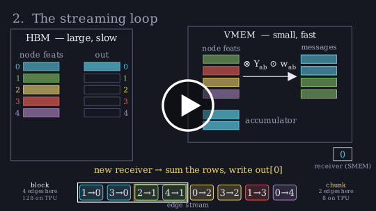

# 🌐 e3j

Euclid-equivariant operations and harmonic polynomials for JAX.

This library is a fast and full-featured Euclidean equivariance
backend which can be used in place of [e3nn] and [e3x] to
replace slow operations in Machine Learned Interatomic Potentials (MLIPs)
with carefully optimized
and open-source CUDA and Pallas kernels for GPU and TPU.

The equivariance backend of our MLIP library is [e3j] as of [mlip] 0.2.0.

> **Note:** `e3j` is currently in pre-release (0.1.0b5),
> with version 0.1.0 planned in July 2026.
> Additional CUDA kernels and dedicated Pallas kernels for TPU
> are being rolled out progressively, supporting infinite differentiability
> and SPMD support.

[e3nn]: https://github.com/e3nn/e3nn-jax
[e3x]: https://github.com/google-research/e3x
[mlip]: https://github.com/instadeepai/mlip

## Installation

### Pulling from PyPI

The [`e3j`][e3j-pypi] package is available on PyPI.
It consists of a thin JAX-based Python API which can run on CPU, GPU and TPU, supporting  Python versions from 3.11 to 3.14 included.

For efficiency on GPU, our CUDA binaries are bundled as the [`e3j_ops`][e3j-ops-pypi]
package on PyPI. The compatible version of the binaries should
be pulled by requiring the `"e3j[ops]"` extra:

```sh
# requirements.txt
e3j[ops] >= 0.1.0b0
jax[cuda13_local] ~= 0.8.0
```
See [JAX installation](https://docs.jax.dev/en/latest/installation.html) instructions for more information on JAX versions and their CUDA support. We recommend using a version of JAX above 0.7.0 and CUDA 13.

### Building from source

Our dependencies are managed with uv. After cloning the repository, you can
build from source by running run one of:

```sh
# Existing CUDA 13 install with `e3j_ops` kernels:
uv sync --group cuda13_local --extra ops
# Install CUDA 13 via pip and the `exp` group for benchmarks:
uv sync --group cuda13 --extra ops
```

The Python build internally relies on CMake, [scikit-build] and pybind11. You can also look at the [Makefile](Makefile) for alternate recipes to build kernels,
C++ tests and the Python bindings.

The [e3j_ops](lib/e3j_ops/README.md)
Python package only contains our CUDA binaries and bindings
to their associated XLA handlers. It is not meant to be used as standalone until its
ABI is reported stable.

## Features

`e3j` provides a platform-agnostic API for GPU and TPU:

- 🖥️ The same Python API on CPU, GPU and TPU, with a portable JAX fallback
wherever the fused kernels do not apply
- ⚛️ Equivariant building blocks: spherical harmonics (`Harmonics`),
tensor products (`TensorProduct`, `Bigotimes`), message-passing convolutions
(`Convolution`), scalar mixing (`ScalarMixing`) and equivariant power
expansions (`PowerExpansion`)
- 🔗 Parameterized operations `Linear` and `LinearIndexwise` as
[flax.linen.Module] instances, with weight initializations matching [e3nn]
- 🏎️ Fused CUDA kernels for GPU (tensor product, message-passing convolution,
scatter-add), shipped as the standalone [`e3j_ops`][e3j-ops-pypi] wheel
and dispatched through XLA-FFI
- 🧮 Fused Pallas Mosaic-TPU kernels, computing gather, tensor product,
scalar mixing and scatter in a single kernel
- 🔁 Custom VJP rules for every fused kernel, so they differentiate
under `jax.grad` like any other JAX primitive
- 🧱 Multiple memory layouts (leading channels, trailing channels, and a flat
[e3nn]-compatible layout) to trade coalescing off against interoperability
- 📐 Representation utilities: O(3) and SO(3) spaces, irreps parsing,
irrep filtering, permutations and generalized Clebsch-Gordan coefficients
- 🔌 Full coverage of the [e3nn] and [e3x] layers used by an MLIP, kernel-backed
or not, so an existing model can be ported over entirely — to train, simulate
and benchmark end to end, see [mlip]

<div align="center">
  <a href="https://instadeepai.github.io/e3j/animation.html"></a>
</div>

[flax.linen.Module]: https://flax-linen.readthedocs.io/en/latest/api_reference/flax.linen/module.html


## Contributing

Although it is too early for [e3j] to accept significant external contributions, bug reports or questions are very welcome via [GitHub][e3j] issues and  discussions.


## Citing
If you use [e3j] within your work, we kindly ask you to cite the following preprint:

```
@article{Peltre26-e3j,
    title   = {{E3J}: an Efficient and Open-Source Euclidean Equivariance Backend},
    author  = {Peltre, Olivier and Picard, Armand and Pichard, Adrien and Giacomoni, Luca and Braganca, Miguel and Heyraud, Valentin and Brunken, Christoph and Tilly, Jules},
    journal = {preprint},
    year    = {2026},
    url     = {(preprint)}
  }
}
```
[e3j]: https://github.com/instadeepai/e3j
[e3j-pypi]: https://pypi.org/projects/e3j
[e3j-ops-pypi]: https://pypi.org/projects/e3j_ops
[scikit-build]: https://scikit-build.readthedocs.io/en/latest/
